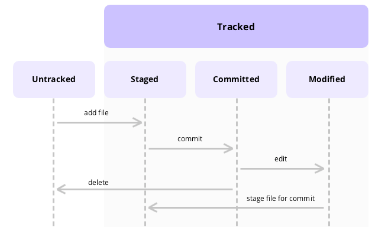
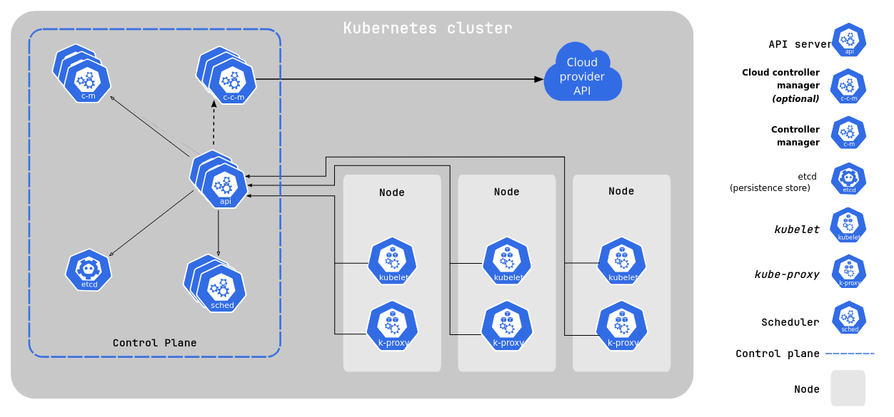
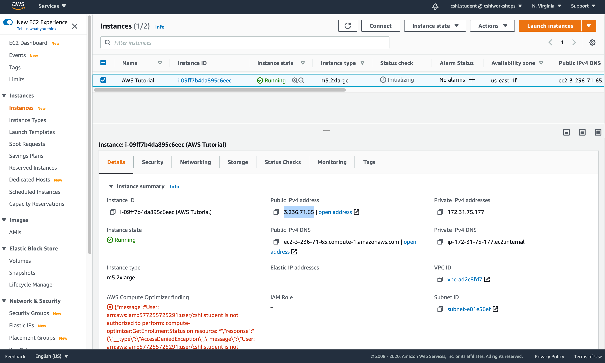

<!-- _class: lead -->

# DevOps Workshop

<br>

**HAM ARC, NIT Warangal**
24th October 2025

---

<!-- _header: Table of Content -->

1. Intro to DevOps
2. Version Control System
3. Github actions
4. Containerization
5. Orchestration
6. Infrastructure as Code

---

<!-- _header: Prerequisites -->

- Laptop
- GitHub account (If you don't have one, then create it at https://github.com)

---

<!-- _header: Intro to DevOps -->

- DevOps = development + operations
- DevOps is a set of practices that integrates the software development and operations to enable faster and more reliable releases
- The primary goals are shorter development cycles, higher deployment frequency, and rapid recovery from failures
- It acts as a bridge between the team that writes the code for the applications and the team that maintains the servers
- Before the rise of DevOps, the software and operations teams used to operate separately, which caused delays in communication, slower release cycles, a lot of manual effort, and slow recovery from failure
- With DevOps, this bridge between both teams streamlines the work. With CI/CD, the entire deployment process is automated, and with IaC, scalability is much easier.

---

<!-- _header: Intro to DevOps -->


---

<!-- _header: Intro to DevOps -->


---

<!-- _header: Version Control System -->

- A version control system (sometimes also referred as source control system) is a software tool that records and manages every change made to files in a project.
- It allows developers to work simultaneously on the same codebase without overwriting or losing each other's changes, enabling effective collaboration among multiple developers.
- Every update of the code is saved, making it possible to revert to any previous state if needed, protecting the project from accidental data loss.
- Developers create a new **branch** for new work on new features/fixing bugs, etc.
- A branch in the context of VCS can be thought of as a copy of the main codebase to which developers can push updates without affecting production.
- At the end, all developers merge their feature branches into a release branch, which is then tested and later merged into the production branch for deployment.

---

<!-- _header: Version Control System -->


---

<!-- _header: Version Control System -->

- A few of the commonly used version control systems are:
  - **Concurrent Verions System (CVS)**: Created in late 1980s and it was one of the first widely used version control systems, offering file-level change tracking with central repository model
  - **Subversion (SVN)**: Introducted in 2000s as a successor for CVS, mainly improving performance while still retaining the central repository model
  - **Git**: Developed by Linus Torvalds for maintaining the Linux codebase
  - **Mercuial**: Distributed, performance-focused VCS, mainly used for huge codebases
  - **Sapling**: It began as a variant of Mercuial by Facebook to handle large-scale monorepos. Later it diverged a bit, now it is a Git-compatible source control system focused on performance and scalability (It uses Rust, btw)

> https://engineering.fb.com/2014/01/07/core-infra/scaling-mercurial-at-facebook/ <br/> https://graphite.dev/blog/why-facebook-doesnt-use-git <br /> https://github.com/facebook/sapling

---

<!-- _header: Intro to Git -->

- Git is the most widely used version control system, mainly due to its simplicity.
- Git was initially designed to do version control on Linux kernel.
- The most powerful feature of git is its **distributed model** i.e. there is single "central server" like CVS and SVN.
- In pre-git era, almost every version control system followed the central repo model where a central repo holds the "official copy" of the code, which had main issues, one of them being that the developer had to connect to the server to make changes/view commit history.
- In case of git, with the distributed repo model, the developer working on the project "clone" the project i.e. giving the developer full copy of the project, including its history. This means that the developer can work, commit, and branch offline.

> What git means: https://github.com/git/git/blob/e83c5163316f89bfbde7d9ab23ca2e25604af290/README#L4-L13

---

<!-- _header: Intro to Git: Installing git -->

- Before moving forward, install git on your laptop.
- If you're currently using Windows/MacOS, install Github desktop from https://desktop.github.com
- If you're using linux, then please run the following commands in the terminal:
  - On ubuntu/debian: `sudo apt-get install git`
  - On fedora: `sudo dnf install git`
  - On arch: `sudo pacman -S git`
- Once you've installed git, verify if the installation was successful by running `git --version` in your terminal
- It's time to _git_ gud at git!

---

<!-- _header: Intro to Git -->


---

<!-- _header: Intro to Git: Setting up git -->

- Open up your terminal and run the following commands to set git

  ```
  git config --global user.name "Your Name"
  git config --global user.email "you@example.com"
  ```

- This should set up git locally and you should be good to go to start using git locally

---

<!-- _header: Intro to Git: Basics of Git -->

- Create a new folder named `git_test` and checkout to that folder using `cd`
- Convert that folder to a git **repository** (specifically a local repository) by running `git init -b main` command within that folder.
  - `git init` command creates a `.git` folder within the `git_test` folder. `.git` folder all the information related to version control of the project such as commit history.
- Create a new file named `test.txt` and fill it up with any information you feel (be creative!).
- Run `git status`, you should be seeing output which says that `test.txt` file is currently **untracked**.
- Run `git add test.txt` to **stage** the files. Run `git status` again, you'd see that `test.txt` is staged
- Run `git commit -m "yay!"` (feel free to change the message from `yay!` to anything which you like) to **commit** the changes

---

<!-- _header: Intro to Git: Basics of Git -->

- Before moving on to the next set of commands, let's go through few of the terms which were used in the previous slide.
- **Repository (repo)** - A folder that tracks all your project files and their version history.
- **Commit**: A snapshot of your project at a point in time, with a message describing changes.
- **File status lifecycle**: The terms "untracked" and "stage" are related to the lifecycle of file status while working with git.
  - Initially, a file is untracked by git i.e. git doesn't track the changes which is done within it
  - To tell git that you need to track this specific file, you need to explicitly run `git add` command, which moves the files to staging area
  - Files that are marked to be included in the next snapshot/commit are present in the staging area i.e. only staged files are recorded when you commit

---

<!-- _header: Intro to Git: Basics of Git -->



---

<!-- _header: Intro to Git: Basics of Git -->

- Now that we have taken a snapshot of our `test.txt` file, we want to now save our precious work somewhere else or else we want to collaborate with someone else who can possibly improve the content of our `test.txt` file
- That is where remote repositories come in, a repository which is designed to recieves pushes and serves a backup location and point of collaboration
- We'd be using **Github** for creating a remote repository. Github (git + hub) is a place for creating git repos which act like remote repos, where user can **push** their local commits and **pull** commits from the github to synchronize changes locally
- Go to https://github.com/new and create a new repo named "git_test"
- Copy the HTTPS URL for connecting to your remote repo

---

<!-- _header: Intro to Git: Basics of Git -->

- Go back to the terminal and run the following commands in your "git_test" folder

  ```
  git remote add origin <http-url>
  ```

- Now you can push i.e. uploading my local commits/snapshots to the remote repo, via `git push -u origin main` command. Yay!

- If you go to your github repo and refresh the page, you should notice a commit named "yay!".

- Change the content of `test.txt` to something else and run `git diff test.txt` to notice the "difference"

- Run `git commit -m "yay! x2"` and `git push -u origin main`

- Well, that was a teeny-tiny bit of git basics which would be helpful while following through this workshop

---

<!-- _header: Intro to Github actions -->

- Github initially started off a cloud based service for hosting git repos, it later launched multiple different products and one of them is Github actions.
- Github actions is an automation tool which allow developer to run some automation code based on certain triggers (i.e. whenever a push to `main` branch takes places or whenever a new pull request is created) or cron schedule. Hence, it is heavily used in CI/CD pipelines.
- Github actions provides runners aka compute (VMs) for executing the automation code. (with some limits, and they even provide the option to bring in your own compute as well aka self hosted runners) [[1]]
- In this workshop, we'll take a look at how to create a simple github action - what is the general structure of a gitub action configuration file, what each of the keyword is for and in what ways can we can use github actions.
- Apart from that, we would also talk a brief look at how to use our laptop as compute while running Github actions.

[1]: https://docs.github.com/en/actions/concepts/runners

---

<!-- _header: Intro to Github actions -->

- Open the "git_test" folder which you created a while back ago and is linked to a github repo.
- Create a new folder named `.github/workflows` under which we would be writing our configuration files for github actions.
- Github actions using YAML (Yet Another Markup Lanugage) for writing down the configuration.
- Create a file named `hello_world.yaml` under `.github/workflows` folder with the following content
- Track the file via `git add`, stage the changes using `git commit` and push the changes to github repo using `git push`

---

```yaml
name: demo workflow

on:
  push:
    branches:
      - main

jobs:
  say-hello:
    runs-on: ubuntu-latest
    steps:
      - name: print hello world
        run: echo "hello, world!"
```

---

<!-- _header: Intro to Github actions -->

- Clicks on the "Actions" tab in your Github repo and then click on "demo workflow"
- Click on your latest commit and then click on the "say-hello" job
- Within the logs, you'd clearly see that "hello, world!" is printed
- Yay! Before moving forward, let's understand what each of the keywords mean in the above configuration file
- `on` is used for specificing on which event trigger should this workflow should be ran [[1]]
- `jobs` is used for mentioning the different jobs each of which has multiple steps and each job is ran on a different runner i.e. you can have two different jobs within the same workflow where one of them runs on linux and other one runs on windows

[1]: https://docs.github.com/en/actions/reference/workflows-and-actions/events-that-trigger-workflows

---

<!-- _header: Intro to Github actions -->

- Let's now try to read content of a file (which is present within the github repo) and print out its content, whenever a push to `main` branch takes place
- We'd need to use `actions/checkout` action for this which would clone the repository contents into the workflow runner
- Create a new file named `output.txt` and push it to the github repo (same steps as we've done previously)
- Create a new file named `read_file.yaml` under `.github/workflows` folder

---

<!-- _header: Intro to Github actions -->

```yaml
name: read file

on:
  push:
    branches:
      - main

jobs:
  read-file:
    runs-on: ubuntu-latest
    steps:
      - name: checkout repo
        uses: actions/checkout@v3

      - name: print contents of output.txt
        run: cat output.txt
```

---

<!-- _header: Intro to Github actions -->

- In this job, we've two steps - "checkout repo" and "print contents of output.txt"
- The checkout repo step clones the repository in the workflow runner so that the workflow runner now has access to the repo's files
- For displaying the content, `cat` command is used
- Let's write one final workflow which is triggered periodically based on CRON schedule, something like sending a request to a random joke API every 5 minutes and printing out the response
- Create a new file named `fetch_joke.yaml` under `.github/workflows` directory

---

<!-- _header: Intro to Github actions -->

```yaml
name: fetch joke

on:
  schedule:
    - cron: "*/5 * * * *"
  workflow_dispatch:

jobs:
  fetch-joke:
    runs-on: ubuntu-latest
    steps:
      - name: fetch random joke
        run: curl -s https://official-joke-api.appspot.com/random_joke | jq
```

---

<!-- _header: Intro to Github actions -->

- `*/5 * * * *` is a CRON schedule which translates to every 1 minute

  ```
  ┌───────────── minute (0–59)
  │ ┌─────────── hour (0–23)
  │ │ ┌───────── day of the month (1–31)
  │ │ │ ┌─────── month (1–12)
  │ │ │ │ ┌───── day of the week (0–6, Sunday=0)
  │ │ │ │ │
  │ │ │ │ │
  * * * * *
  ```

- `workflow_dispatch` allows the developer to manually trigger the workflow for quick debugging
- `curl` is used for sending HTTP request to the random joke API and the output is piped into the input of `jq` which formats the JSON response

---

<!-- _header: Intro to Github actions -->

- Let's now try out self-hosted runners
- Go to your github repo and click on "Actions" tab and then on "Runners"
- Click on "Self-hosted runners" and choose your operating system and run the set of commands
- To start the runner, run the `run` script
- Now to your the self-hosted runner in our workflows, change `runs-on: ubuntu-latest` to `runs-on: self-hosted` in any one of the workflows

---

<!-- _header: Intro to Github actions -->

```yaml
name: demo workflow

on:
  push:
    branches:
      - main

jobs:
  say-hello:
    runs-on: self-hosted
    steps:
      - name: print hello world
        run: echo "hello, world!"
```

---

<!-- _header: Virtualization and Containerization -->

- Within virtualization and containerization, we're basically running a "computer" inside a computer
- But, what's the point of running a computer inside a computer?
  - Isolation and testing the software on different operating systems and hardware specs without extra physical resources
  - Running multiple machines on a single computer for resource utilization efficiency (vRAM)
- One of the main difference between virtualization and containerization is that within virtualization, a complete virtual OS is present with its on own kernel on top of the hypervisor
- In containerization, it uses the host OS kernel and it is generally much lighter than running VMs

<!-- - In containerization and virtualization, we're basically have a computer inside our computer, but what's the main use of it?
  - Isolation and testing on different OS, different hardware models without extra resources
  - Running multiple machines on a single computer for resource utilization efficiency
- One of main difference is that in virtualization, the complete OS is virtualizaed i.e. a VM has it's own OS kernel on top of the hypervisor. In containerization, it uses the host OS kernel.
- Containers are much lighter than VMs and containers are meant to be "distributed" and "disposable" i.e. long term data isn't to be stored on the container -->

---

<!-- _header: Virtualization and Containerization -->

- Containers are meant to be distributed and dispoable i.e. long term data isn't meant to be stored on the container
- Within this workshop, we'd be mainly focusing on containerization
- There are a lot of tools which helps you to create and manage containers. Few of the popular ones are Docker and Podman
- Docker needs background service (daemon, `dockerd`) to run containers. Podman runs containers without that service and can without root access, isolating the container processes under user's own permissions
- Podman is a daemonless container engine

---


---

<!-- _header: Intro to Docker -->

- Before jumping into the details of Docker, let's go through some basic terminology which is commonly used in the context of Docker
- **Images**: Docker images are read-only template for creating the container. Each image is built in layers where each layer represents some operations such as installing a specific system library, setting some environment variable or exposing a port
- **Dockerfile**: Dockerfile is the script via which docker images are generated
- **Containers**: Docker containers are the running isolated instances of the Docker image
- **Volumes**: Volumes are the location on your computer where the docker container store data which is meant to be persisted for a long time (persistent storage)

---

<!-- _header: Intro to Docker -->

- For installing Docker, please follow the below instructions:
  - On Windows/MacOS, install Docker desktop - https://www.docker.com/products/docker-desktop/
  - On Ubuntu/Debain, go through this article by DigitalOcean (On ubuntu/debian, go through this article by DO - https://www.digitalocean.com/community/tutorials/how-to-install-and-use-docker-on-ubuntu-20-04)
  - On Arch, run the following commands
    ```
    sudo pacman -S docker
    sudo systemctl enable --now docker
    sudo usermod -aG docker $USER
    ```

---

<!-- _header: Intro to Docker -->

- Let's now run Ubuntu using docker

  ```bash
  docker run -it ubuntu:latest bash
  ```

- `docker run` command is used to run Docker images
- `-it` flag indicates that run it in interactive mode
- `ubuntu:latest` is the latest image of Ubuntu from Dockerhub
- `bash` is the command which is to ran within the container

---

<!-- _header: Intro to Docker -->

- Let's now try to play a bit more and try to attach GUI
- For this, we're doing to use VNC (Virtual Network Computing) which is a protocol that allows remote control of another computer over network
- Run the following command

  ```
  docker run -p 6080:80 -v /dev/shm:/dev/shm dorowu/ubuntu-desktop-lxde-vnc
  ```

- Open http://127.0.0.1:6080 in your browser and you should be able to see a desktop GUI

- `-p` flag maps a port on the host to a port inside the container
- `-v` flag mounts a directory or file from host into the container
- `dorowu/ubuntu-desktop-lxde-vnc` is the name of the docker image

---

<!-- _header: Intro to Docker -->

- Until now, we have been playing with docker using docker image made by other people. Now let's make a docker image by ourselves using dockerfile
- Let's write a Dockerfile to containerize a simple HTTP server written in python using `http` module
- The code for the HTTP server is available at https://github.com/0xMukesh/ham-devops-workshop/blob/main/misc/webserver_basic.py
- Create a new file named `Dockerfile` where we would write the _recipe_ for on how to generate the docker image

---

```python
from http.server import SimpleHTTPRequestHandler, HTTPServer


class CustomHandler(SimpleHTTPRequestHandler):
    def do_GET(self):
        if self.path == "/":
            self.send_response(200)
            self.send_header("Content-type", "text/plain")
            self.end_headers()
            self.wfile.write(b"pong")
        else:
            super().do_GET()


HOST = "0.0.0.0"
PORT = 8080

if __name__ == "__main__":
    server = HTTPServer((HOST, PORT), CustomHandler)
    server.serve_forever()
```

---

<!-- _header: Intro to Docker -->

```docker
FROM python:3.11-slim

WORKDIR /app

COPY webserver_basic.py .

EXPOSE 8080

CMD ["python", "webserver_basic.py"]
```

- `FROM` keyword is used to set the base image to build from
- `WORKDIR` keyword is used to set the working directory and all the subsequent commands like `COPY`, `RUN` and `CMD` are executed within that directory
- `COPY` keyword copies a file from local directory into the container's working directory

---

<!-- _header: Intro to Docker -->

- `EXPOSE` keyword declares/gives a signal to the user and orchestration tools that the application is listening on that specific port
- `CMD` keyword specific the default command which is to be ran when the container starts

---

<!-- _header: Intro to Docker -->

- To build the docker image, run `docker build -t http-server .` within the directory which has `Dockerfile`
- Run `docker images` to get a list of all the available locally
- Run `docker system prune -a` to remove all docker images, containers, networks and build cache
- Run `docker run -p 8080:8080 http-server` to start the python web server
- Go to http://127.0.0.1:8080 and the server should respond with "pong"

---

<!-- _header: Intro to Docker -->

- Before jumping into the next part of the workshop, let's take a moment and understand how does Docker work under the hood briefly.
- Docker mainly uses two core Linux kernel APIs namely `cgroup` and `namespaces` which allows Docker to create the _isolated_ containers with _restricted_ amount of resources.
- Each of the namespace share the same host's OS kernel instead or running their own kernel.
- `cgroup` and `namespaces` are APIs provided by Linux kernel which allow Docker to isolate different containers (aka processes) and control resource consumed by each process.
- Docker isn't natively supported on Windows due to this dependency on Linux kernel features. Docker on Windows runs a very light weight Linux VM using WSL and executes the containers via that.

---

<!-- _header: Intro to Docker -->

- Docker reads a `Dockerfile` from top to bottom
- Each instruction (`FROM`, `COPY`, `RUN` etc.) creates an immutable layer which is addressed by a SHA256 hash.
- Layers are read-only filesystem snapshots representing the incremental changes in a Docker image.
- When multiple images share identical layers (eg. same base image) then Docker reuses them, reducing disk use and speeding up build time.
- Layers are stacked using a union filesystem, forming the file Docker image.
- If an instruction and its inputs are unchanged from a previous build, Docker reuses the cached build instead of rebuilding it.
- Once a layer changes, all the layers after it are invalidated and rebuilt.
- That is the reason why less frequently changed instructions (eg. installing system deps) are placed earlier in the Dockerfile for maximum cache reuse.

---

<!-- _header: Intro to Docker -->

- Multi-stage builds are generally used for optimizing the final size of the Docker image, where multiple temporary images are created within a single Dockerfile and each image has only access to the build output of the previous one, thereby reducing the final size of the Docker image
- Using small base images for final stage is another approach for optimizing the final size of the Docker image. Using slim base images like alpine or distroless images is a good approach

---

<!-- _header: Intro to Docker -->

```docker
FROM node:20-alpine as builder
WORKDIR /app
RUN yarn global add turbo
COPY . ./
RUN turbo prune --scope=@cleopetra/ingestor --docker

FROM node:20-alpine as installer
WORKDIR /app
RUN yarn global add pnpm

COPY --from=builder /app/out/full/.gitignore ./.gitignore
COPY --from=builder /app/out/full/turbo.json ./turbo.json
COPY --from=builder /app/out/pnpm-lock.yaml ./pnpm-lock.yaml
COPY --from=builder /app/out/pnpm-workspace.yaml ./pnpm-workspace.yaml
COPY --from=builder /app/out/full/ .

RUN pnpm install --no-frozen-lockfile --ignore-scripts
RUN pnpm build:ingestor

FROM node:20-alpine AS runner
WORKDIR /app

COPY --from=installer /app .

CMD ["node", "./apps/ingestor/dist/index.js"]
```

---

<!-- _header: Intro to Docker compose -->

- The web server example which we saw earlier was very simple. Most of the times, your web server would need to communicate with some data source like a database
- We can containerize both database and the web server application and run the individually but the issue with that is we need to separate the networking between them and apart from that we would need to manually type in the start commands for both of them, so prune to a lot of typos
- To remove this hassle, Docker compose was introduced. It is a simple tool which is used to define and run multiple containers within a single host

---

<!-- _header: Intro to Docker compose -->

- Copy the `webserver_advanced.py` and `requirements.txt` file from `misc` folder of the reference github repo (https://github.com/0xmukesh/ham-devops-workshop)
- Let's first create a dockerfile for our webserver. Create a new dockerfile named `Dockerfile.advanced` (`.advanced` suffix is just used to differentiate between the dockerfiles of this webserver and the previous one)
- Within this, we would need to copy both the source code and `requirements.txt` and the install the dependencies using `pip`

---

<!-- _header: Intro to Docker compose -->

```docker
FROM python:3.11-slim

WORKDIR /app
COPY webserver_advanced.py .
COPY requirements.txt .

RUN pip install --no-cache-dir -r requirements.txt

EXPOSE 5000
CMD ["python", "webserver_advanced.py"]
```

---

<!-- _header: Intro to Docker compose -->

- Create a new file named `docker-compose.yml` where we would define the configuration for both of our containers (webserver + postgres database), volumes and networking between both the containers so that the webserver can connect with postgres database
- Docker compose creates a bridge network for the project and all the services in the compose file are automatically connected to this network
- Docker compose injects an internal DNS resolver using which containers can reach out to each other using their service names defined in `docker-compose.yml`

---

<!-- _header: Intro to Docker compose -->

```docker
services:
  web:
    build:
      context: .
      dockerfile: Dockerfile.advanced
    ports:
      - "5000:5000"
    environment:
      POSTGRES_HOST: db
      POSTGRES_DB: testdb
      POSTGRES_USER: user
      POSTGRES_PASSWORD: password
    depends_on:
      - db
    networks:
      - app-network

  db:
    image: postgres:16
    environment:
      POSTGRES_DB: testdb
      POSTGRES_USER: user
      POSTGRES_PASSWORD: password
    volumes:
      - pgdata:/var/lib/postgresql/data
    networks:
      - app-network

networks:
  app-network:

volumes:
  pgdata:
```

---

<!-- _header: Intro to Docker compose -->

- To build + run the containers, run `docker-compose up --build` within the directory where the `docker-compose.yml` file is present
- To run it as a background process, add `-d` flag
- To stop all the running containers + remove their volumes + remove any additional other orphans, run `docker-compose down -v --remove-orphans`
- To stream logs to STDOUT in real-time, run `docker-compose logs -f` command
- To run a specific command within a container, run `docker-compose exec <service> <command>` command

---

<!-- _header: Intro to Kubernetes -->

- Docker Compose is great for running multiple containers on a single host, but in real-world production environments, applications need to scale across multiple machines and handle failures automatically.
- Kubernetes, or k8s, is a platform designed to **orchestrate containers** at scale. It manages deployment, scaling, networking, and health of your containerized applications.
- With Kubernetes, you don’t have to manually start or link containers. You define your desired state (like how many instances of a service you want) in a YAML file, and K8s ensures the system matches that state.
- Kubernetes introduces core concepts such as **Pods** (the smallest deployable unit), **Deployments** (manages updates and scaling), and **Services** (handles networking and load balancing between Pods), making applications more resilient and easier to manage across clusters of machines.

---

<!-- _header: Intro to Kubernetes -->

- k8s is all about taking a bunch of VMs which run docker containers and having an unified API layer to which the developer can interact with to manage (orchestrate) those VMs
- **Pods**: Collection of containers which are co-located on a single machine
- **Service**: A service layer is generally above the pods which acts like a load balancer which bring the traffic down to a collection of pods
- **Deployment**: Deployment is a high level abstraction that manages the pods and ensures that they've reached the desired state for your application. It manages number of replicas for each application, rolling updates and rollbacks, self-healing

---

<!-- _header: Intro to Kubernetes -->



---

<!-- _header: Infrastructure as Code (IaC) -->



---

```
# Configure the AWS Provider
terraform {
  required_providers {
    aws = {
      source  = "hashicorp/aws"
      version = "~> 5.0"
    }
  }
}

provider "aws" {
  region = "us-east-1"
}
```

---

```
# Create an S3 Bucket
resource "aws_s3_bucket" "my_bucket" {
  bucket = "my-devops-workshop-bucket-12345"  # Change this to a unique name

  tags = {
    Name        = "My Workshop Bucket"
    Environment = "Learning"
  }
}

# Block public access (security best practice)
resource "aws_s3_bucket_public_access_block" "my_bucket_block" {
  bucket = aws_s3_bucket.my_bucket.id

  block_public_acls       = true
  block_public_policy     = true
  ignore_public_acls      = true
  restrict_public_buckets = true
}

```

---

```
# Output the bucket name
output "bucket_name" {
  value = aws_s3_bucket.my_bucket.id
}
```

---

```

```

---
