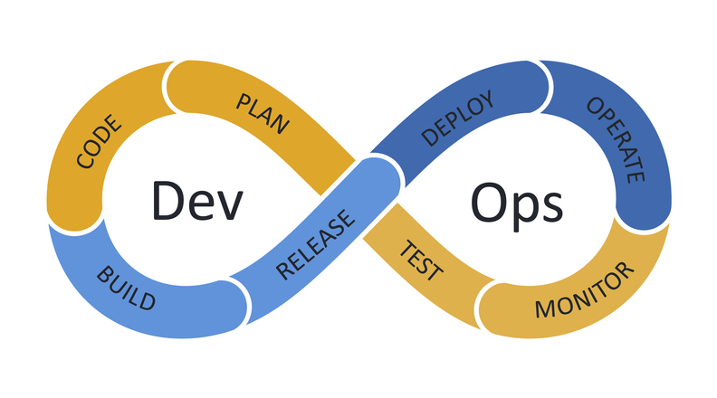

<!-- _class: lead -->

# DevOps Workshop

<br>

**HAM ARC, NIT Warangal**
24th October 2025

---

<!-- _header: Table of Content -->

1. Intro to DevOps
2. Version Control System
3. Github actions
4. Containerization
5. Orchestration
6. Infrastructure as Code
7. Monitoring

---

<!-- _header: Prerequisites -->

- Laptop
- GitHub account (If you don't have one, then create it at https://github.com)

---

<!-- _header: Intro to DevOps -->

- DevOps = development + operations
- DevOps is a set of practices that integrates the software development and operations to enable faster and more reliable releases
- The primary goals are shorter development cycles, higher deployment frequency, and rapid recovery from failures
- It acts as a bridge between the team that writes the code for the applications and the team that maintains the servers
- Before the rise of DevOps, the software and operations teams used to operate separately, which caused delays in communication, slower release cycles, a lot of manual effort, and slow recovery from failure
- With DevOps, this bridge between both teams streamlines the work. With CI/CD, the entire deployment process is automated, and with IaC, scalability is much easier.

---

<!-- _header: Intro to DevOps -->


---

<!-- _header: Intro to DevOps -->



---

<!-- _header: Version Control System -->

- A version control system (sometimes also referred as source control system) is a software tool that records and manages every change made to files in a project.
- It allows developers to work simultaneously on the same codebase without overwriting or losing each other's changes, enabling effective collaboration among multiple developers.
- Every update of the code is saved, making it possible to revert to any previous state if needed, protecting the project from accidental data loss.
- Developers create a new **branch** for new work on new features/fixing bugs, etc.
- A branch in the context of VCS can be thought of as a copy of the main codebase to which developers can push updates without affecting production.
- At the end, all developers merge their feature branches into a release branch, which is then tested and later merged into the production branch for deployment.

---

<!-- _header: Version Control System -->


---

<!-- _header: Version Control System -->

- A few of the commonly used version control systems are:
  - **Concurrent Verions System (CVS)**: Created in late 1980s and it was one of the first widely used version control systems, offering file-level change tracking with central repository model
  - **Subversion (SVN)**: Introducted in 2000s as a successor for CVS, mainly improving performance while still retaining the central repository model
  - **Git**: Developed by Linus Torvalds for maintaining the Linux codebase
  - **Mercuial**: Distributed, performance-focused VCS, mainly used for huge codebases
  - **Sapling**: It began as a variant of Mercuial by Facebook to handle large-scale monorepos. Later it diverged a bit, now it is a Git-compatible source control system focused on performance and scalability (It uses Rust, btw)

> https://engineering.fb.com/2014/01/07/core-infra/scaling-mercurial-at-facebook/ <br/> https://graphite.dev/blog/why-facebook-doesnt-use-git <br /> https://github.com/facebook/sapling

---

<!-- _header: Intro to Git -->

- Git is the most widely used version control system, mainly due to its simplicity.
- Git was initially designed to do version control on Linux kernel.
- The most powerful feature of git is its **distributed model** i.e. there is single "central server" like CVS and SVN.
- In pre-git era, almost every version control system followed the central repo model where a central repo holds the "official copy" of the code, which had main issues, one of them being that the developer had to connect to the server to make changes/view commit history.
- In case of git, with the distributed repo model, the developer working on the project "clone" the project i.e. giving the developer full copy of the project, including its history. This means that the developer can work, commit, and branch offline.

> What git means: https://github.com/git/git/blob/e83c5163316f89bfbde7d9ab23ca2e25604af290/README#L4-L13

---

<!-- _header: Intro to Git: Installing git -->

- Before moving forward, install git on your laptop.
- If you're currently using Windows/MacOS, install Github desktop from https://desktop.github.com
- If you're using linux, then please run the following commands in the terminal:
  - On ubuntu/debian: `sudo apt-get install git`
  - On fedora: `sudo dnf install git`
  - On arch: `sudo pacman -S git`
- Once you've installed git, verify if the installation was successful by running `git --version` in your terminal
- It's time to _git_ gud at git!

---

<!-- _header: Intro to Git -->


---

<!-- _header: Intro to Git: Setting up git -->

- Open up your terminal and run the following commands to set git

  ```
  git config --global user.name "Your Name"
  git config --global user.email "you@example.com"
  ```

- This should set up git locally and you should be good to go to start using git locally

---

<!-- _header: Intro to Git: Basics of Git -->

- Create a new folder named `git_test` and checkout to that folder using `cd`
- Convert that folder to a git **repository** (specifically a local repository) by running `git init` command within that folder.
  - `git init` command creates a `.git` folder within the `git_test` folder. `.git` folder all the information related to version control of the project such as commit history.
- Create a new file named `test.txt` and fill it up with any information you feel (be creative!).
- Run `git status`, you should be seeing output which says that `test.txt` file is currently **untracked**.
- Run `git add test.txt` to **stage** the files. Run `git status` again, you'd see that `test.txt` is staged
- Run `git commit -m "yay!"` (feel free to change the message from `yay!` to anything which you like) to **commit** the changes

---

<!-- _header: Intro to Git: Basics of Git -->

- Before moving on to the next set of commands, let's go through few of the terms which were used in the previous slide.
- **Repository (repo)** - A folder that tracks all your project files and their version history.
- **Commit**: A snapshot of your project at a point in time, with a message describing changes.
- **File status lifecycle**: The terms "untracked" and "stage" are related to the lifecycle of file status while working with git.
  - Initially, a file is untracked by git i.e. git doesn't track the changes which is done within it
  - To tell git that you need to track this specific file, you need to explicitly run `git add` command, which moves the files to staging area
  - Files that are marked to be included in the next snapshot/commit are present in the staging area i.e. only staged files are recorded when you commit

---

<!-- _header: Intro to Git: Basics of Git -->

- Now that we have taken a snapshot of our `test.txt` file, we want to now save our precious work somewhere else or else we want to collaborate with someone else who can possibly improve the content of our `test.txt` file
- That is where remote repositories come in, a repository which is designed to recieves pushes and serves a backup location and point of collaboration
- We'd be using **Github** for creating a remote repository. Github (git + hub) is a place for creating git repos which act like remote repos, where user can **push** their local commits and **pull** commits from the github to synchronize changes locally
- Go to https://github.com/new and create a new repo named "git_test"
- Copy the HTTPS URL for connecting to your remote repo

---

<!-- _header: Intro to Git: Basics of Git -->

- Go back to the terminal and run the following commands in your "git_test" folder

  ```
  git remote add origin <http-url>
  ```

- Now you can push i.e. uploading my local commits/snapshots to the remote repo, via `git push -u origin main` command. Yay!

- If you go to your github repo and refresh the page, you should notice a commit named "yay!".

- Change the content of `test.txt` to something else and run `git diff test.txt` to notice the "difference"

- Run `git commit -m "yay! x2"` and `git push -u origin main`

- Well, that was a teeny-tiny bit of git basics which would be helpful while following through this workshop

---

<!-- _header: Intro to Github actions -->

- Github initially started off a cloud based service for hosting git repos, it later launched multiple different products and one of them is Github actions.
- Github actions is an automation tool which allow developer to run some automation code based on certain triggers (i.e. whenever a push to `main` branch takes places or whenever a new pull request is created) or cron schedule. Hence, it is heavily used in CI/CD pipelines.
- Github actions provides runners aka compute (VMs) for executing the automation code. (with some limits, and they even provide the option to bring in your own compute as well aka self hosted runners) [[1]]
- In this workshop, we'll take a look at how to create a simple github action - what is the general structure of a gitub action configuration file, what each of the keyword is for and in what ways can we can use github actions.
- Apart from that, we would also talk a brief look at how to use our laptop as compute while running Github actions.

[1]: https://docs.github.com/en/actions/concepts/runners

---

<!-- _header: Intro to Github actions -->

- Open the "git_test" folder which you created a while back ago and is linked to a github repo.
- Create a new folder named `.github/workflows` under which we would be writing our configuration files for github actions.
- Github actions using YAML (Yet Another Markup Lanugage) for writing down the configuration.
- Create a file named `test_job.yaml` under `.github/workflows` folder with the following content
- Track the file via `git add`, stage the changes using `git commit` and push the changes to github repo using `git push`

---

```yaml
name: demo workflow

on:
  push:
    branches:
      - main

jobs:
  say-hello:
    runs-on: ubuntu-latest
    steps:
      - name: print hello world
        run: echo "hello, world!"
```

---

<!-- _header: Intro to Github actions -->

---
